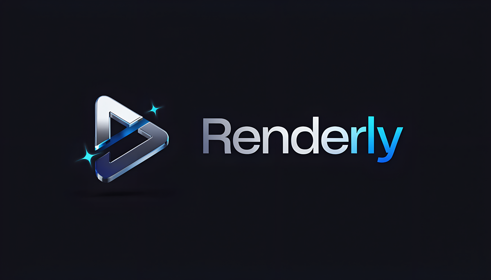

<p align="center">
  
</p>

# Renderly

**An open-source, native video editor built for AI agents — and the humans who finish the job.**

Renderly is a from-scratch, cross-platform video editor aimed at closing the gap between
free and workflows currently locked behind paywalled editors. It has two goals that
reinforce each other:

1. Every single edit operation is driven through one command API, so an AI agent (Claude
   Code, or any other model via MCP) can do the entire ideate → clip → order → caption →
   voiceover pass on its own, with a human doing final polish at the end.
2. The feature set — effects, transitions, filters, stickers, captions styles — is built
   by its community as plugins and asset packs, not gated behind a subscription.

Not affiliated with, endorsed by, or a clone of any existing commercial editor.

## Status

**Early / pre-alpha — Phases 0–3 complete, Phase 4 heuristics landed, polish push underway.**
CLI and MCP drive the full command API. Export renders video with burned-in captions,
mixed audio, speed/atempo, transitions, and effects. The Tauri desktop app (Windows)
provides the GUI with a professionally themed dark-first UI, a CapCut-style project home
screen (date-named projects, auto-save, live thumbnails), and a **webview preview driven
by the real Rust compositor compiled to WebAssembly/WebGPU** — the same effect/transition
code paths as export, at 60 fps. A loopback **live bridge** lets an MCP agent edit the
project while the app is open: changes appear in the GUI instantly and share the user's
undo stack. macOS/Linux CI builds the workspace.

Examples: [`examples/packs/starter`](examples/packs/starter),
[`examples/plugins/invert`](examples/plugins/invert),
[`examples/registry`](examples/registry). Manual QA: [docs/qa-checklist.md](docs/qa-checklist.md).

Read [PLAN.md](PLAN.md) for the full vision and roadmap, and
[docs/improvement-plan.md](docs/improvement-plan.md) for the current perf/UX workstreams,
before contributing or building on this.

## Why

Editing gameplay footage to a script in a paywalled editor works, but too many of the
features that make it fast — the ones that actually matter — sit behind a subscription.
Renderly is an attempt to build the same caliber of editor as free, open, and automatable
software, so the tool decides nothing about what you're allowed to do.

## Architecture at a glance

```
renderly-core/     headless Rust engine — project model, command API, media I/O, compositing.
                    No UI dependencies. The single source of truth every frontend calls into.
renderly-cli/       thin CLI over the command API — scriptable, the simplest agent-drivable surface.
renderly-mcp/       MCP server exposing the same commands + perception tools to AI agents;
                    proxies to the running desktop app's live bridge when one is open.
renderly-wasm/      renderly-core's compositor compiled to wasm32 + WebGPU — the desktop
                    app's preview renderer (same WGSL as export, zero readback).
renderly-app/       Tauri 2 desktop app; React UI + wasm compositor preview in the webview.
```

One command API, one project schema, dispatched identically by the GUI, the CLI, and the
MCP server — see [docs/architecture.md](docs/architecture.md) for the full picture and
[docs/command-api.md](docs/command-api.md) / [docs/project-schema.md](docs/project-schema.md)
for the exact specs the code implements. The preview migration story (why the preview
moved from a native child window into the webview) is documented in
[docs/preview-webview.md](docs/preview-webview.md); the live agent bridge contract is
[docs/bridge-protocol.md](docs/bridge-protocol.md).

**Tech stack:** Rust engine (FFmpeg, wgpu, whisper.cpp for local captions, local/BYO-key TTS)
+ Tauri 2 / React UI. The preview decodes via the browser's `<video>` elements and
composites with renderly-core's own compositor compiled to WebAssembly (WebGPU, Canvas2D
fallback) — one compositor for preview and export, never two implementations of an effect.
Plugins are sandboxed WebAssembly; simple content ships as no-code asset packs.
Windows first, macOS/Linux to follow. AGPL-3.0.

## Roadmap

- **Phase 0** — done: schema, commands, CLI export spine (FFmpeg → wgpu → H.264).
- **Phase 1** — done: MCP server, Whisper captions, TTS voiceover, audio fades/ducking,
  perception tools (silence, scenes, peaks, frame render, transcript).
- **Phase 2** — done: Tauri GUI with timeline tools, preview, audio scrub, export.
- **Phase 3** — done: effects, transitions, keyframes, WASM plugin SDK and asset pack format.
- **Phase 4 (current)** — parity march: heuristic implementations landed (background
  removal, motion tracking, stabilize, auto-reframe, templates, multicam); ML-model
  upgrades on hold. In parallel: performance/UX overhaul and the live agent bridge
  ([docs/improvement-plan.md](docs/improvement-plan.md)).

Full detail in [PLAN.md](PLAN.md) §4.

## Getting started

```sh
git clone <repo-url>
cd video-editor
cargo build --workspace
cargo test --workspace
```

Try the CLI:

```sh
cargo run -p renderly-cli -- new-project demo.renderly.json --name "my-edit"
cargo run -p renderly-cli -- apply demo.renderly.json '{"command":"AddTrack","kind":"audio","name":"A1"}'
cargo run -p renderly-cli -- show demo.renderly.json
cargo run -p renderly-cli -- export demo.renderly.json out.mp4 --preset tiktok
```

Export requires `ffmpeg` and `ffprobe` on PATH (used as subprocesses; linked
`ffmpeg-the-third` is planned once vcpkg/FFMPEG_DIR is wired for all environments).

### Desktop app

Requires Node.js 20+, Rust, `wasm-pack` (`cargo install wasm-pack`), and FFmpeg on PATH.

```sh
cd renderly-app
npm install
npm run build:wasm   # builds renderly-wasm into src/wasm-pkg (once, and after Rust compositor changes)
npm run tauri dev
```

The webview UI dispatches all edits via `apply_command`; the preview composites in-webview
with the WASM compositor (WebGPU). Projects live in `Documents/Renderly` with auto-save,
date-based names, and self-refreshing gallery thumbnails.

### MCP (AI agents)

```sh
cargo run -p renderly-mcp
```

Configure it in your agent's MCP settings and it can create, edit, caption, voice, and
export projects headlessly — or, when the desktop app is running, drive the open project
**live**: edits appear in the GUI immediately, share the undo stack (Ctrl+Z undoes agent
changes), and `render_frame` returns the same pixels the user sees.
See [docs/mcp-agent-guide.md](docs/mcp-agent-guide.md) for the tool list, agent workflow,
and environment variables (`RENDERLY_WHISPER_MODEL` for auto-captions,
`RENDERLY_PIPER_MODEL` for local TTS, `OPENAI_API_KEY` for OpenAI voiceover).

## Contributing

Code or no-code, there's a way in — see [CONTRIBUTING.md](CONTRIBUTING.md). If you're an AI
agent working in this repo, read [AGENTS.md](AGENTS.md) first; it's the enforceable
contract behind everything summarized above.

## License

[AGPL-3.0](LICENSE) — forks and hosted services must stay open source.
